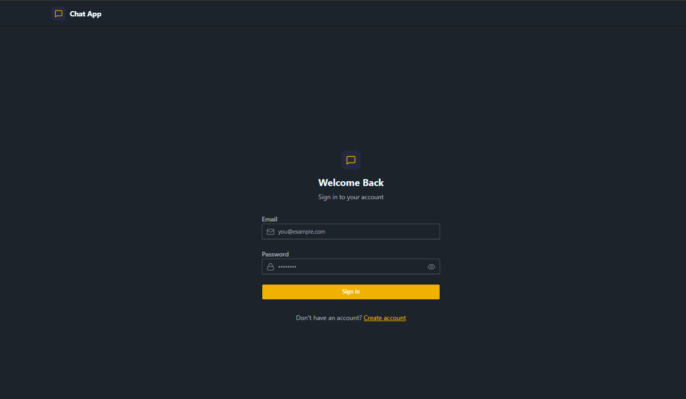
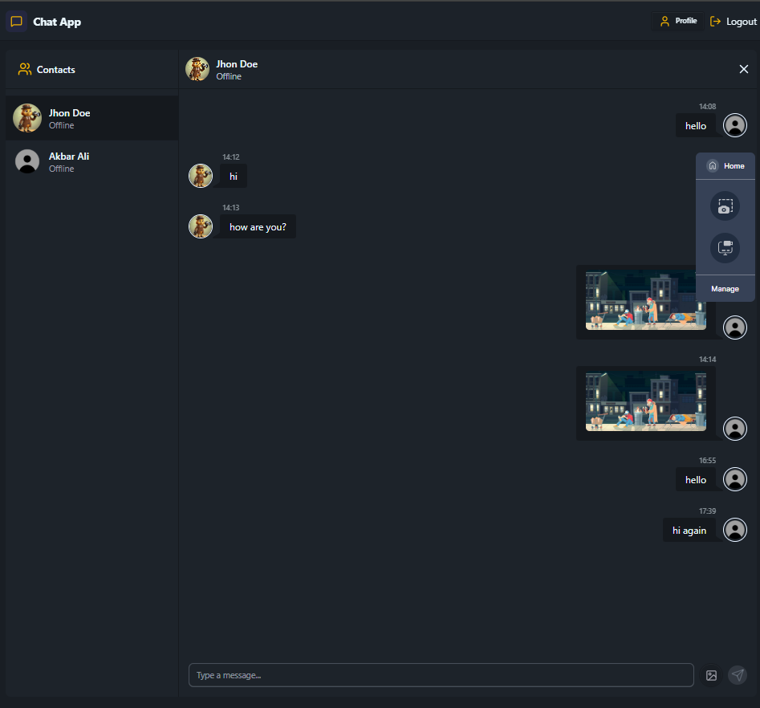

# Real-Time Chat App

A real-time chat application built with **MERN**, and **Socket.io**. This app allows users to register, log in, and chat with other users in real-time with a user-friendly interface.

## Features

* User authentication (sign up, login, logout)
* Real-time messaging between users using Socket.io
* Display of online/offline users
* User profile management (uploading profile photo, viewing name and email)
* Support for sending images and messages
  
## Tech Stack

* **Frontend:** React.js,Tailwind CSS, DaisyUI, JavaScript
* **Backend:** Node.js, Express.js
* **Database:** MongoDB
* **Real-time Communication:** Socket.io
* **Authentication:** JWT (JSON Web Tokens)

## Installation

1. **Clone the repository**

```bash
git clone https://github.com/FatimaSohailll/Real-Time-Chat-App.git
cd Real-Time-Chat-App
```

2. **Install dependencies**

* Backend:

```bash
cd backend
npm install
```

* Frontend:

```bash
cd ../frontend
npm install
```

3. **Set up environment variables**
   Create a `.env` file in the backend folder with the following:

```env
MONGO_URI=....
PORT=5000
JWT_SECRET=....
NODE_ENV=development
CLOUDINARY_CLOUD_NAME=....
CLOUDINARY_API_KEY=....
CLOUDINARY_API_SECRET=....
```

4. **Start the development server**

* Backend:

```bash
cd backend
npm run dev
```

* Frontend:

```bash
cd frontend
npm run dev
```

5. **Open the app**
   Visit [http://localhost:5173](http://localhost:5173) in your browser.

## Screenshots

### Login Page


### Chat Interface


## Inspiration

This project is an ispiration of https://www.youtube.com/watch?v=ntKkVrQqBYY

## License

This project is licensed under the MIT License.
